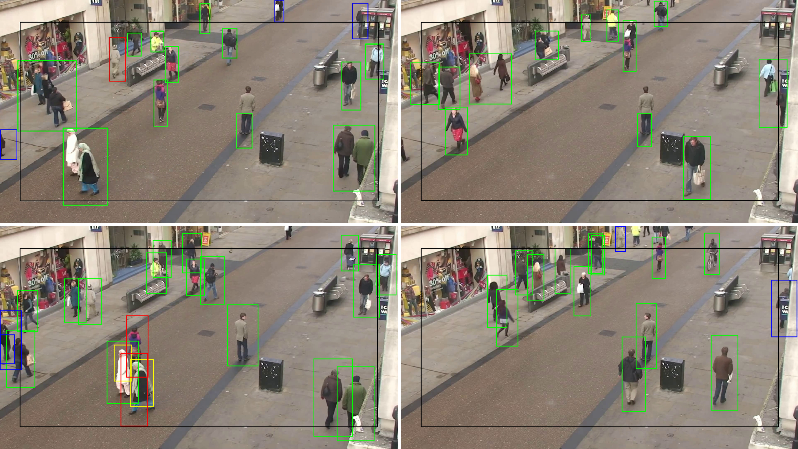

# Real-time object recognition algorithms for autonomous devices

My BSc thesis made on Alogithmic Computer Science Major of Wroclaw Univeristy of Science and Technology in 2025

*Detection samples in order: Background subtraction for 1 color channel, background substraction for 3 color channels, Support Vector Machine with HOG features, YOLOv11-nano convolutional neural network*

Background substraction algorithms results may look worse than YOLO, but they have much lower inference time without GPU than YOLO and detect every moving object, which is good for survelliance camera use case.

## Abstract

The subject of this thesis is the analysis of algorithms for recognizing objects in the real world, using the example of detecting pedestrians in recordings from city surveillance cameras. The thesis compares various detection methodologies, such as background subtraction, histogram of oriented gradients (HOG) on a support vector machine (SVM), and the YOLO convolutional neural network model. The key challenge is to achieve high accuracy in real-time with limited computing power. In addition, the thesis describes the functioning of each methodology, their strengths and weaknesses, and assesses the difficulty of implementing solutions. The results of the thesis can be used to create object detectors using the most suitable methodology for real-world conditions.

## Keywords

Computer vision, pedestrian, background substraction, histogram of oriented gradients, support vector machine, YOLO neural network

## References

All used references are placed in `thesis.pdf`